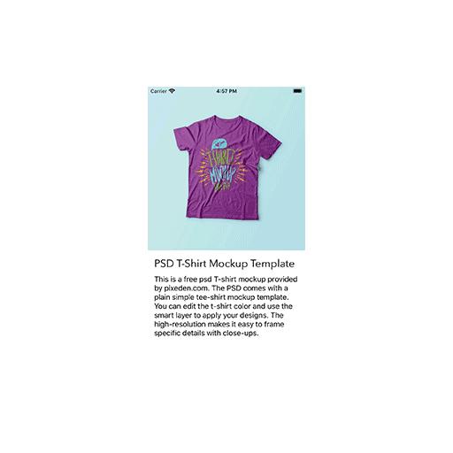
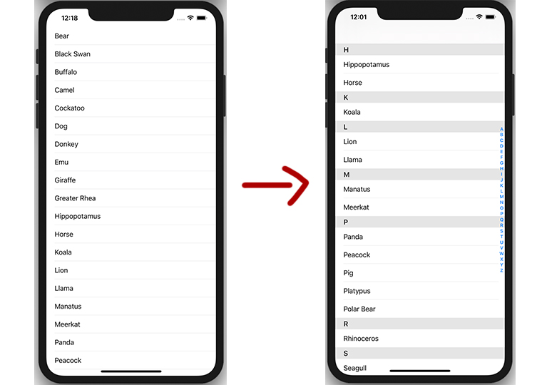
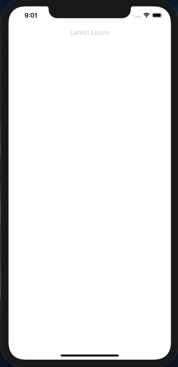
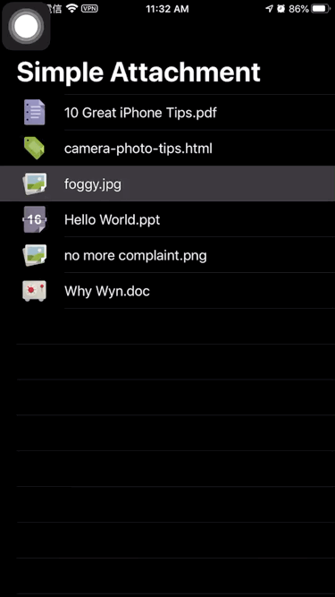
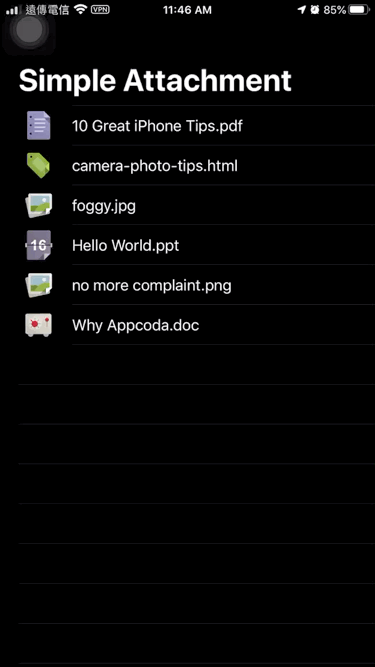
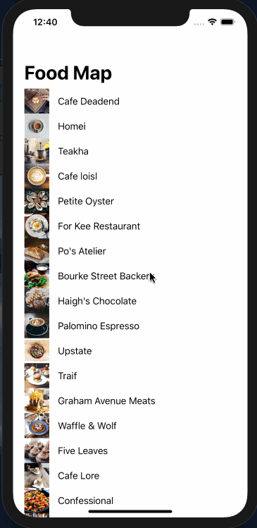
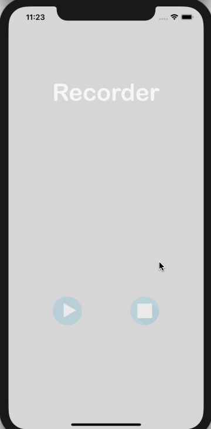
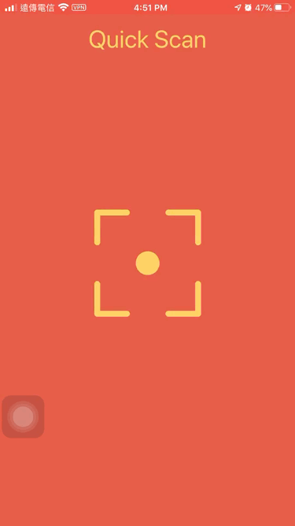
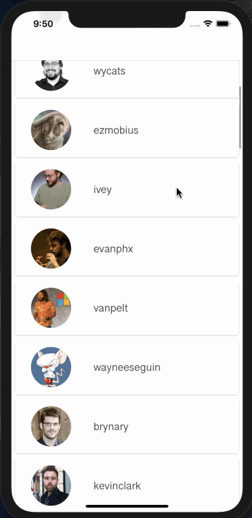

# Swift-Learning
This is my studied about swift.

## 01 - AdaptiveUI
未撰寫程式碼。主要使用 Storyboard 來進行使用者介面元件的佈局，使用 Auto Layout 以及尺寸類別來讓 UI 可以自適應。
建立一個具有單一視圖控制器（view controller），可以適應多種螢幕尺寸以及方向的 App。

  
## 02 - IndexedTable  [Blog](https://medium.com/@k022298/add-an-index-in-tableview-feeb919f82ab)
在表格視圖中顯示一系列的動物清單。除了列出所有動物外，這個 App 將動物群組起來至不同區塊，並顯示一個可以快速存取的索引列表。 

  
## 03 - TableCellAnimation
加入動畫使表格動畫更加活潑
- 淡入動畫
- 使用 CATransform3D 建立旋轉特效
- 使用 CATransform3DTranslate 建立飛入特效 

  
## 04 - KivaLoan
使用 [Kiva.org](https://www.kiva.org/) 的 JSON API來取得最近的融資貸款。
- 建立 JSON 資料模型
- 使用 Kiva API 取得貸款資料
- 使用 Codable 來解碼 JSON
- 在表格視圖顯示貸款資料 

  
## 05 - SocialSharing
整合 Facebook 與 Twitter 所提供的 SDK，使使用者可以在 App 中推文到 Twitter 或刊登到 Facebook 上，實作分享功能。 

  
## 06 - EmailAttachment
使用 MessageUI 這個內建 API 撰寫一個簡單的 App 來示範如何傳送 email 與如何加入 email 附加檔案。 

  
## 07 - SMS
使用 MessageUI 進行 SMS 與 MMS 傳送 

  
## 08 - MapKitDirection
使用 MKDirections API
- 取得目前使用者的位置
- 計算路徑並將它畫在地圖上
- 使用分段控制
- 取得路徑步驟並顯示開車/步行路徑的導引 

  
## 09 - LocalSearch
使用 MKLocalSearch API 實行在地圖上搜尋附近同性質的地點並顯示在地圖上。 

  
## 10 - Record  [Blog](https://medium.com/@k022298/create-an-audio-recorder-in-xcode-30adaec2e1d7)
使用 AVFoundation framework 的 AVAudioRecorder 與 AVAudioPlayer 製作一個錄音加播放的APP。

  
## 11 - QRCodeReader
使用 AVFoundation framework 實行 偵測 QR Code 並進行資訊解碼，配合 URL Scheme 可以直接打開並傳送訊息至其他應用程式。 

  
## 12 - SampleCamera
使用 AVFoundation framework 來建立相機介面
- 使用前鏡頭與後鏡頭相機來擷取靜態圖像
- 使用手勢辨識器來偵測滑動（swipe）手勢
- 為相機 App 加入縮放功能
- 儲存圖片至照片膠卷
  
## 13 - SimpleVideoCamera
使用 AVFoundation framework 錄製影片並用 AVKit 播放影音檔。
  
## 14 - GoogleAd
使用 CocoaPods 安裝 Google Mobile Ads SDK 製作表格視圖標題顯示橫幅廣告與播放插播廣告。
  
## 15 - CustomFont
使用程式自訂字型
  
## 16 - AirDrop
建立 UIActivityViewController 的實例，透過 AirDrop 來分享圖片與檔案。
  
## 17 - CollectionView
使用 UICollectionView 製作一個簡單的商品清單。
  
## 18 - DoodleFun
延續上一章，新增互動功能
- 當使用者按下圖示時，這個 App 會帶出一個強制回應（Modal）視圖，並將圖示以較大的尺寸來顯示。
- 新增複選動作，實作分享功能。使用者可以選擇多張圖示，並使用動態視圖控制器來進行分享。
- 加入 Cell 為自適應式，集合視圖 Cell 的大小會依照裝置類型及其方向做調整。
  
## 19 - Weather
用 Widget 外掛顯示的 App 的最新天氣資訊。
  
## 20 - SlideBar
採用 John Lluch 的[SWRevealViewController](https://github.com/John-Lluch/SWRevealViewController)函式庫實作一個滑動式的漢堡選單。
- 使用者按下了導覽列上左上角的選單按鈕後，觸發了選單
- 使用者亦可以手指向內容區右邊滑動來帶出選單
- 選單出現後，使用者可以再次按下左上角的選單按鈕關掉它
- 使用者亦可在內容區上，往左拖曳來關掉選單
  
## 21 - NavTransition
實作視圖控制器轉場以及動畫。
  
## 22 - SliderDownMenu
實作一個下拉式的選單以及動畫。
  
## 23 - SelfSizingCell
Cell 尺寸自適應與動態型態
- 針對 Prototype cell 定義 Auto Layout 約束條件
- 指定表格視圖的 estimatedRowHeight 屬性
- 設定表格視圖的 rowHeight 屬性為 UITableViewAutomaticDimension
  
## 24 - SimpleRSSReader
使用 XMLParser 解析讀取 XML 檔 製作一個 RSS 閱讀器應用，與製作表格視圖 Cell 的展開。
  
## 25 - VisualEffect
使用 UIVisualEffect 來產生模糊背景。
  
## 26 - TouchID
使用 Local Authentication framework 實行使用 Touch ID 與 Face ID 驗證。
  
## 27 - TripCard
建構一個似轉盤的使用者介面顯示旅遊的列表應用。
  
## 28 - Parse
使用 CocoaPods 安裝 Parse ，並使用第三方後端服務供應商[Back4App](https://www.back4app.com/)進行資料管理，將 TripCard 的資料改為線上資料庫，新增以下功能。
- 新增 APP 刷新資料功能
- 透過 APP 更新 Parse 上的資料
- 透過 APP 刪除 Parse 上的資料
- 快取速度與離線存取
  
## 29 - CoreDataPreload
使用 Core Data 來解析 CSV 與預載一個 SQLite 資料庫
- 解析 CSV 檔
- 資料預載與儲存至資料庫
- 使用外部資料檔
- 在專案中使用現有的資料庫
  
## 30 - Route
使用 MKDirections API 來取得在多個標註（annotation）間以路徑為基礎的方向，並在地圖視圖上顯示路徑。
- 使用手勢偵測器偵測觸控用按壓的方式在地圖上定位一個位置
- 大頭針落下動畫
- 以折線連結標註
- 連結標註與路徑
- 移除標註
  
## 31 - CuteSticker
建立一個簡單的貼圖 App。
  
## 32 - CollectionViewSelection
建立一個 iMessage App，讓使用者可以馬上在訊息 App 中取得圖示。使用者可以挑選一個圖示並傳送給另一位使用者。在接收端，接收者只要點擊訊息便可以打開此圖示來觀看細節。
- 使用嵌入的框架來分享程式
- 設計 iMessage App 的UI
- 加入訊息至對話中
- 按下訊息 App 後，帶出細節視圖控制器，顯示資訊細節
  
## 33 - FancyButton
使用 IBDesignable 與 IBInspectable 來自訂 UI 元件。
  
## 34 - Firebase
使用 Firebase 實作使用者 Facebook 、Google 與 Email 登入驗證，實作使用者帳號相關的功能。
- 註冊
- 登入
- 登出
- 重設密碼
- Email 認證
  
## 35 - FirebaseStorage
使用 Firebase Database 與 Storage 來建立一個 Instagram 類型的 App
- 使用 ImagePicker 這個第三方函式庫來建立像 Instagram 一樣的相機 UI。
- 使用 Firebase Database來儲存資料（例如，貼文資訊）並在 Firebase 資料庫中建構 JSON 資料。
- 使用 Firebase Storage 來儲存圖片。
- 利用 Firebase Database 與 Storage 來進行資料的上傳與下載。
- 限制從 Firebase 下載的資料數。
- 在表格視圖實作無限的滾動（scroll）。
  
## 36 - ImageRecognition
使用 Apple 現成已經訓練過的 Core ML 模型 [Inception v3](https://docs-assets.developer.apple.com/coreml/models/Inceptionv3.mlmodel)實作即時影像辨識應用。
  
## 37 - ARKitDemo
使用 SpriteKit 與 ARKit 做一個簡單的 AR APP，實作以下功能。
- 加入 2D 物件至真實世界的空間中
- 將 2D 物件從空間移除
- 跟虛擬物件互動
  
## 38 - ARKitRobot
- 配對 SceneKit 與 ARKit
- 加入 3D 物件至 AR 環境中
- 偵測一個水平面並將虛擬 3D 物件放進去
  
## 39 - SwiftUI-Text
使用SwiftUI做文字的處理。
  
## 40 - Bullseye
線上課程[raywenderlich](https://www.raywenderlich.com/4919757-your-first-ios-and-swiftui-app/lessons/1)，使用 SwiftUI 做一個目測比例的Game。
  
## 41 - PitchPerfect
線上課程[Udacity](https://classroom.udacity.com/courses/ud585)，製作一個變音應用。
  
## 42 - MaskMap
參考[彼得潘的文章](https://medium.com/%E5%BD%BC%E5%BE%97%E6%BD%98%E7%9A%84-swift-ios-app-%E9%96%8B%E7%99%BC%E5%95%8F%E9%A1%8C%E8%A7%A3%E7%AD%94%E9%9B%86/%E7%94%A8-jsondecoder-%E8%A7%A3%E6%9E%90%E5%8F%A3%E7%BD%A9%E5%89%A9%E9%A4%98%E6%95%B8%E9%87%8F-api-a32e967ec9c1)串接[政府資料開放平臺 API](https://data.gov.tw/dataset/116285) 將診所口罩庫存呈現在表格試圖上。
- 使用 Postman 測試口罩剩餘數量 API 回傳的 JSON 資料
- 利用 JSONDecoder 解析口罩 API 的 JSON 資料
  
## 43 - GitHubUser
- GitHub API
- MVVM architecture
- Rest API - Fetch data from the server.
- Display cell shadow and spacing between cell by UIView.

