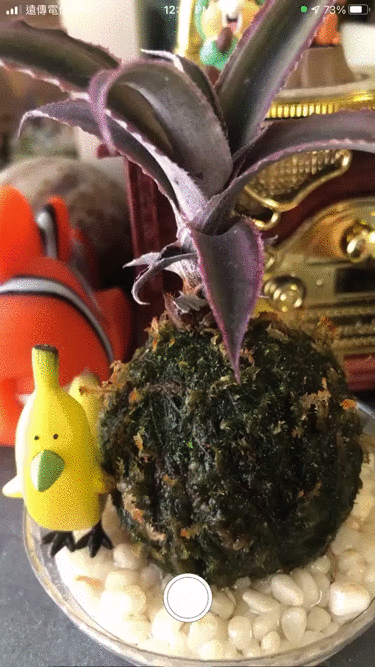
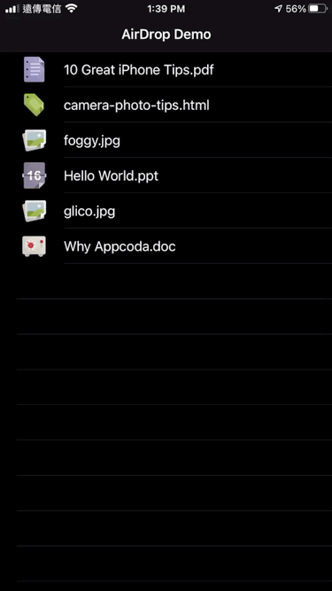
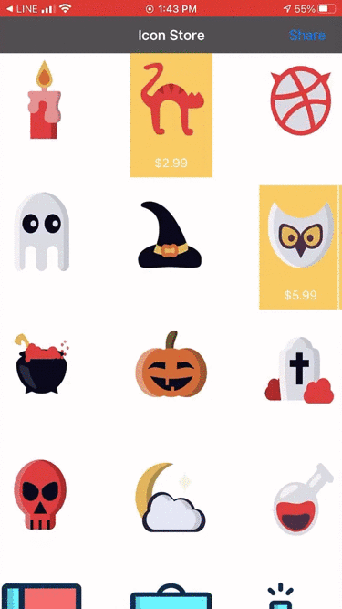
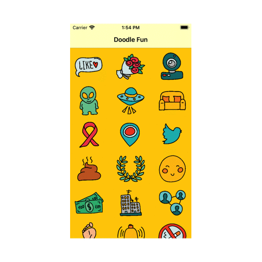
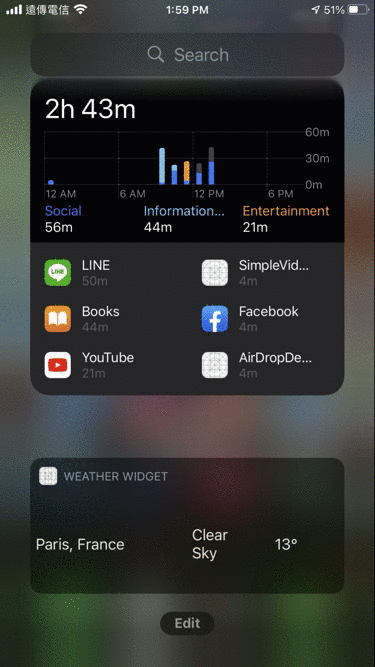
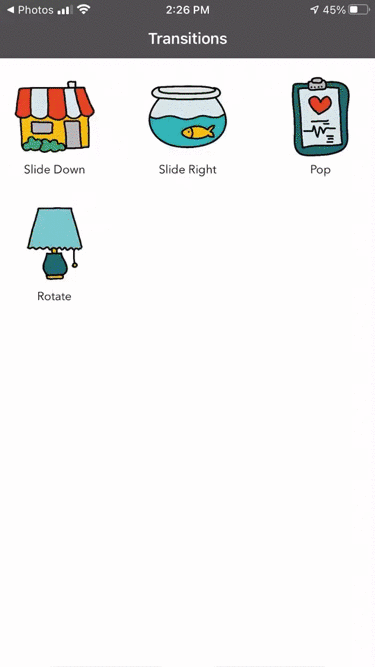
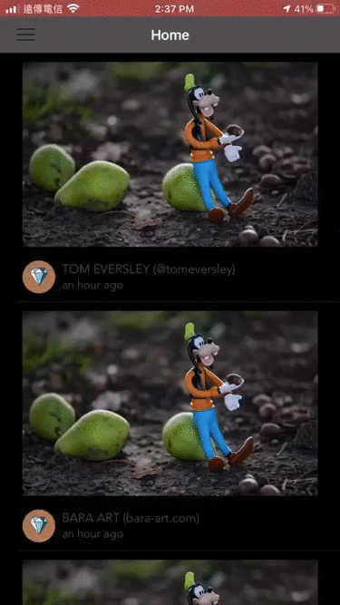
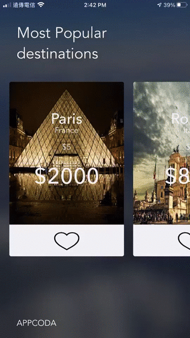
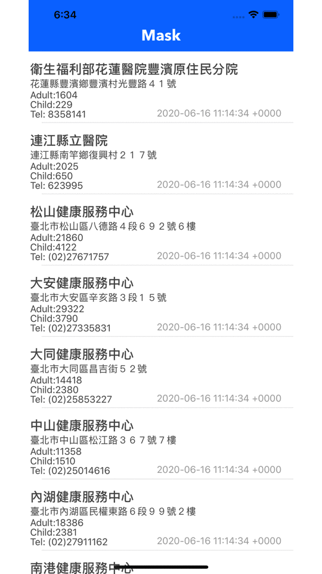

# iOS-App-practice-projects
It's a repository for me to practice iOS app development via books and online courses. 
Including iOS SDK features and third-library framework API integration. 
Resources:
- [AppCoda](https://www.appcoda.com/)
- [Udacity](https://classroom.udacity.com/courses/ud585)
- [raywenderlich](https://www.raywenderlich.com/4919757-your-first-ios-and-swiftui-app/lessons/1)
- [彼得潘的文章](https://medium.com/%E5%BD%BC%E5%BE%97%E6%BD%98%E7%9A%84-swift-ios-app-%E9%96%8B%E7%99%BC%E5%95%8F%E9%A1%8C%E8%A7%A3%E7%AD%94%E9%9B%86/%E7%94%A8-jsondecoder-%E8%A7%A3%E6%9E%90%E5%8F%A3%E7%BD%A9%E5%89%A9%E9%A4%98%E6%95%B8%E9%87%8F-api-a32e967ec9c1)

## 01 - AdaptiveUI
Implemented the auto layout UI with storyboard. 
It can be adapted to the landscape and portrait orientation on both iPhones and iPads. 

  

## 02 - IndexedTable [Blog](https://medium.com/@k022298/add-an-index-in-tableview-feeb919f82ab)
Showed a list of items on tableView with the indexed. 

  

## 03 - TableCellAnimation
Implemented animation effects on UITableView cells.
- CATransform3D
- CATransform3DTranslate 

  

## 04 - KivaLoan
Called [Kiva.org](https://www.kiva.org/) API to fetch JSON data and show on the UITableView.
- Created Codable JSON model
- Fetched JSON data from Kiva API
- Showed data on table view 

  

## 05 - Social Sharing
Integrated Facebook and Twitter SDK，Users can share content to Twitter or Facebook.
- Twitter SDK
- Facebook SDK 

  

## 06 - EmailAttachment
Implemented the feature of email attachment with MessageUI SDK.- MessageUI SDK 

  

## 07 - SMS
Implemented the feature of sending SMS and MMS with MessageUI SDK.
- MessageUI SDK 

  

## 08 - MapKitDirection
- MKDirections SDK
- Get user's location
- Get target's location
- Calculate the route and show on the map
- Get the steps of route of by car and by walk 

  

## 09 - LocalSearch
Showing the similar places on map by MKLocalSearch API. 

  

## 10 - Record  [Blog](https://medium.com/@k022298/create-an-audio-recorder-in-xcode-30adaec2e1d7)
It's an app for user to record and play their sound.
- AVAudioRecorder
- AVAudioPlayer 

  

## 11 - QRCodeReader
Implemented the feature of scan QR codes, launching and sending messages to other apps via URL Scheme. 

  

## 12 - SampleCamera
Implemented a camera application.
- AVFoundation
- take picture with front/ back camera
- detect swipe gesture
- zoom in/ out
- save photos to album 

  

## 13 - SimpleVideoCamera
Implemented a video camera including record and playing video.
- AVFoundation
- AVKit 

  

## 14 - GoogleAd
Showed google advertisement on application.
- Google Mobile Ads SDK
  

## 15 - CustomFont
Implemented custom font style.
  

## 16 - AirDrop
Share photos and files via AirDrop.
- UIActivityViewController 

  

## 17 - DoodleFun
Implemented a auto layout cell on UICollectionView.
- UICollectionView 

  

## 18 - CollectionView
It's a project continues the previous one but with more interactive events.
- Select cell to show a view to present detail of the item
- Multiple select
- Share content via UIActivityViewController 

  

## 19 - Weather
Present whether with Widget.
- Widget 

  

## 20 - SlideBar
Implemented a burger slider bar menu by John Lluch's library[SWRevealViewController](https://github.com/John-Lluch/SWRevealViewController) 

  

## 21 - NavTransition
Implemented navigation transition and animation 

  

## 22 - SliderDownMenu
Implemented a slider down menu 

  

## 23 - SelfSizingCell
Implemented a self sizing cell
  

## 24 - SimpleRSSReader
Parse XML file and show content on tableView.
  

## 25 - VisualEffect
Implemented a blur effect view
- UIVisualEffect 

  

## 26 - TouchID
Implemented Touch ID and Face ID verify authentication
- Local Authentication
- Touch ID
- Face ID
  

## 27 - TripCard
Implemented a turntable view to present content 

  

## 28 - Parse
Follow with previous project # 27, extend a database [Back4App](https://www.back4app.com/) to store/ download data
- Update/ reload data
- Delete data
- Offline cache
  

## 29 - CoreDataPreload
Prefetch a SQLite database and parse CSV by Core data
  

## 30 - Route
Show route on map with multiple annotation
- MKDirections
- Animation
  

## 31 - CuteSticker
It's an simple sticker pack extension
  

## 32 - CollectionViewSelection
Implemented an iMessage App，users can load images in App, pick image and share to other user.
- Nested framework to share application
- iMessage
  

## 33 - FancyButton
Implemented custom UI components with IBDesignable and IBInspectable.
  

## 34 - Firebase
Implemented Facebook, Google, and Email account features with Firebase
- Register
- Login
- Logout
- Reset account
- Email verify
  

## 35 - FirebaseStorage
It's an app like Instagram
- Used third party ImagePicker library to create a camera like Instagram
- Used Firebase Database to store data
- Used Firebase Storage to store images
- Implemented upload and download via Firebase Database and Storage
- Limited the amount of download in Firebase
  

## 36 - ImageRecognition
Implemented a application to Identify image via Apple Core ML model [Inception v3](https://docs-assets.developer.apple.com/coreml/models/Inceptionv3.mlmodel)
  

## 37 - ARKitDemo
使用 SpriteKit 與 ARKit 做一個簡單的 AR APP，實作以下功能。
- SpriteKit
- ARKit
- Add 2D model into reality environment
- Remove 2D model from environment
- Interact with virtual model
  

## 38 - ARKitRobot
- SceneKit
- ARKit
- Add a 3D model into AR environment
- Scan a surface and show 3D model
  

## 39 - SwiftUI-Text
I practiced how to deal with text with SwiftUI.
  

## 40 - Bullseye
Reference: [raywenderlich](https://www.raywenderlich.com/4919757-your-first-ios-and-swiftui-app/lessons/1)，It's a game app implemented with SwiftUI.
  

## 41 - PitchPerfect
Reference: [Udacity](https://classroom.udacity.com/courses/ud585)，It's an app that can record/ change/ play users' voices.
  

## 42 - MaskMap
Reference: [彼得潘的文章](https://medium.com/%E5%BD%BC%E5%BE%97%E6%BD%98%E7%9A%84-swift-ios-app-%E9%96%8B%E7%99%BC%E5%95%8F%E9%A1%8C%E8%A7%A3%E7%AD%94%E9%9B%86/%E7%94%A8-jsondecoder-%E8%A7%A3%E6%9E%90%E5%8F%A3%E7%BD%A9%E5%89%A9%E9%A4%98%E6%95%B8%E9%87%8F-api-a32e967ec9c1)
[API](https://data.gov.tw/dataset/116285) It's an app that can show the number of masks within the stores on the table view.

  

## 43 - GitHubUser
- GitHub API
- MVVM architecture
- Rest API - Fetch data from the server.
- Display cell shadow and spacing between cell by UIView. 

